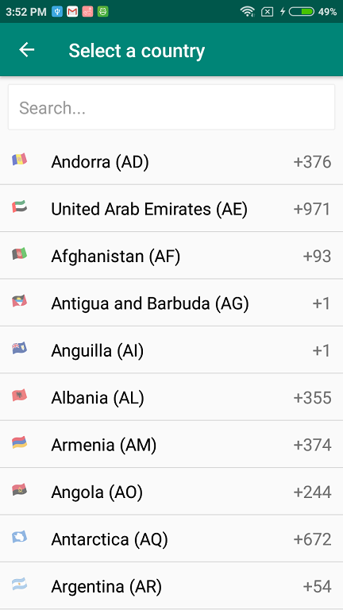

# Country Code Picker Library for Android

CountryCodePicker is an android library which provides an easy way to search and select country or country phone code for the telephone number.
#### Used emojis instead of images for flags.

[](https://jitpack.io/#gsanthosh91/CountryCodePicker)

 

## How to add to your project

Add jitpack.io to your root build.gradle file:
````
allprojects {
  repositories {
    ...
    maven { url 'https://jitpack.io' }
  }
}
````

Add this to your gradle file and sync
````
dependencies {
  implementation 'com.github.gsanthosh91:CountryCodePicker:v1.0.1'
}
 ````
 
 ````
dialCode.setOnClickListener(new View.OnClickListener() {
  @Override
  public void onClick(View view) {
      Intent intent = new Intent(MainActivity.this, CountryPickerActivity.class);
      startActivityForResult(intent, 11);
  }
});
````

````
@Override
protected void onActivityResult(int requestCode, int resultCode, Intent data) {
    if (requestCode == 11) {
        if (resultCode == Activity.RESULT_OK) {
            Country country = (Country) data.getSerializableExtra("country");
            initCountry(country);
        }
    }
}
````

Get country object by Locale
````
Country localeCountry = Country.getCountryByLocale(Locale.getDefault());
````

## Features

* Easy to integrate in your android project
* Search filter by country name, county code, and dial code.
* Get country object by `Locale`


